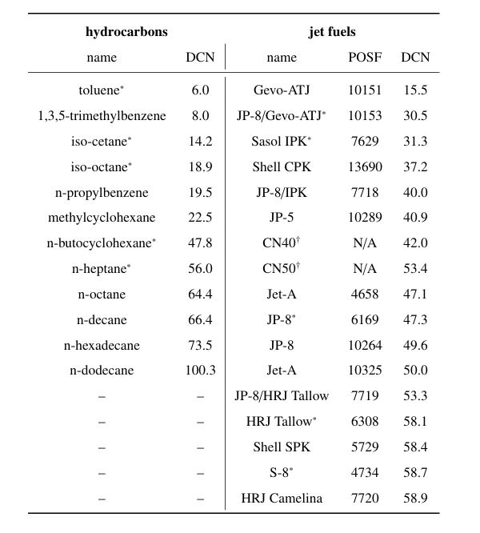

# Dataset-hydrocarbon-and-fuel-processing

This dataset contains a total of 46 hydrocarbon and 55 jet fuel T2 relaxation curves along with their associated derived cetane numbers (DCNs). The T2 relaxation curves were probed using a compact time domain nuclear magnetic resonance (TD-NMR) system located at the University of South Carolina, Columbia, USA [1]. 

## Data

All of the T2 relaxation data is provided in a single excel file. The first two sheets of the excel file contain hydrocarbon and jet fuel T2 curve data, while the third sheet summarizes the DCN of samples. The codes example.m and example.py give examples of how to read data from the excel file and make some plots in MATLAB and Python, respectively. 

Table 1: The 12 hydrocarbon and 15 jet fuel samples used to generate datasets. Reported DCN values are subject to small uncertainties (approximately $\pm 1$).

   

   

Figure 1: Example pure hydrocarbon and jet fuel T2 curves.

## References

[1] Jacob Martin, Austin R.J. Downey, Win Janvrin, and Angelo Varillas, "Compact-NMR (cNMR)," August 2023. [Online]. URL: https://github.com/ARTS-Laboratory/Compact-NMR

## Licensing and Citation

[![CC BY-SA 4.0][cc-by-sa-shield]][cc-by-sa]

This work is licensed under a
[Creative Commons Attribution-ShareAlike 4.0 International License][cc-by-sa].

[cc-by-sa]: http://creativecommons.org/licenses/by-sa/4.0/
[cc-by-sa-image]: https://licensebuttons.net/l/by-sa/4.0/88x31.png
[cc-by-sa-shield]: https://img.shields.io/badge/License-CC%20BY--SA%204.0-lightgrey.svg

Cite as:

@Misc{Huggins2024HydrocarbonFuelData,   
  author = {Parker Huggins and Jacob Martin and Austin Downey and Sang Hee Won},   
  howpublished = {GitHub},  
  title  = {Dataset-hydrocarbon-and-fuel-processing},   
  year   = {2024},  
  groups = {{ARTS-L}ab},    
  url    = {https://github.com/ARTS-Laboratory/Dataset-hydrocarbon-and-fuel-processing},    
}
