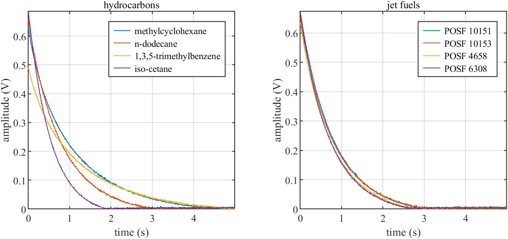

# Dataset-hydrocarbon-and-fuel-processing

This dataset contains a total of 46 hydrocarbon and 55 jet fuel T2 relaxation curves along with their associated derived cetane numbers (DCNs). The T2 relaxation curves were probed from samples using a compact time domain nuclear magnetic resonance (TD-NMR) system located at the University of South Carolina, Columbia, USA [1]. 

## Data

Below are (1) a table summarizing the samples present in the hydrocarbon and jet fuel datasets and (2) an example figure showing the T2 relaxation curves of select samples. 

   

