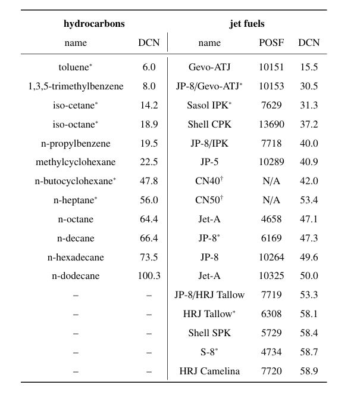
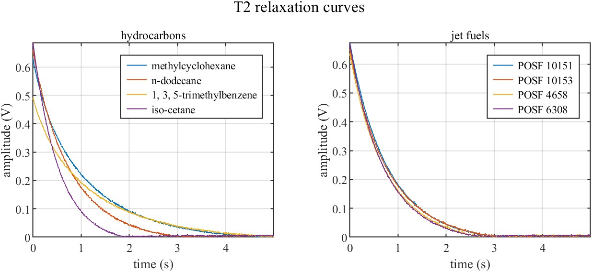

# 0.645 Tesla magnet
This dataset was collected using a 0.645 Tesla magnet at 27.5 MHz. It contains a total of 161 T2 relaxation curves probed from 12 pure hydrocarbon and 17 jet fuel samples. The derived cetane number (DCN) of all samples are also provided. The T2 relaxation curves were acquired using a compact time-domain nuclear magnetic resonance (TD-NMR) system located at the University of South Carolina, Columbia, USA [1]. 

## Data

All of the T2 relaxation data is provided in excel files. The first two sheets of the training and validation data excel files contain hydrocarbon and jet fuel T2 curve data. The third sheet of the training data excel file summarizes the DCN of the samples. The code example.m gives an example of how to read data and make some plots in MATLAB. 

Table 1: The 12 hydrocarbon and 17 jet fuel samples used to generate datasets. Reported DCN values are subject to small uncertainties (approximately $\pm1$). $^\ast$ Reprobed for validation data. $^\dagger$ Test samples.

   

   

Figure 1: Example pure hydrocarbon and jet fuel T2 curves.

